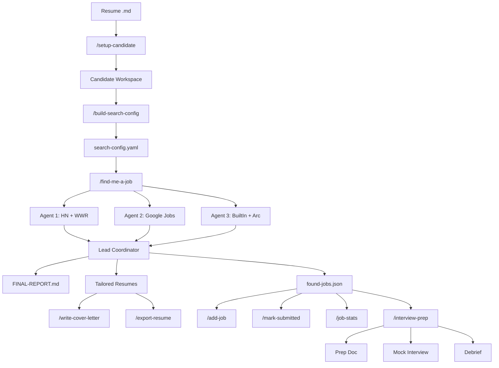

# hire-me-agents

I got laid off and built a robot army to find my next job.

Multi-agent job search automation for [Claude Code](https://claude.ai/code). Nine slash commands that search job boards with parallel AI agents, score matches against your profile, generate ATS-optimized tailored resumes, prep you for interviews with mock sessions, and track your full application pipeline — including unemployment reporting data.

No application code. No dependencies beyond Python's `python-docx` for optional DOCX export. Just markdown files orchestrating Claude Code.

## Why This Exists

I built this two weeks after getting laid off. Within 30 minutes of the call, I was designing the architecture. The system found me an interview within two weeks of going live. I open-sourced it because if it works for me, it should work for anyone.

## How It Works



You provide a markdown resume. The system bootstraps a workspace, generates search preferences, spawns parallel agents across job boards, scores every match against a 6-dimension rubric, generates per-job tailored resumes optimized for each company's ATS platform, and compiles everything into a structured report. From there, you can add jobs manually, generate cover letters, export to DOCX, track applications, pull unemployment reporting data, or run full interview prep with mock sessions.

## Features

- **Multi-agent parallel search** — 3-5 agents searching different sources simultaneously (HN Who's Hiring, We Work Remotely, Google Jobs aggregation, Built In, Arc.dev, direct career pages)
- **6-dimension scoring rubric** — Stack Match (30%), Experience Fit (20%), Company Stability (15%), Comp Range (15%), Remote/Location (10%), Role Type (10%)
- **ATS platform detection** — Identifies Greenhouse, Ashby, Lever, Workday, iCIMS, Taleo and applies per-platform keyword strategy
- **Per-job tailored resumes** — Rewrites summary, reorders skills, adjusts experience bullets, preserves exact contact info. ATS keyword optimization mirrors listing terminology verbatim.
- **Cover letter generation** — Culture signal detection, gap analysis, self-check rubric. Not "write me a cover letter" — a reasoning system that mirrors the listing's language and addresses mismatches honestly.
- **Interview prep pipeline** — Company research, predicted questions with STAR-format answers from real resume experience, gap analysis with objection handling, AI & modern tooling positioning, salary negotiation strategy
- **Interactive mock interviews** — Three difficulty levels (standard, tough, gauntlet). Real-time scoring, immediate feedback, follow-up questions. Gauntlet mode is deliberately adversarial.
- **Post-interview debrief** — Analyzes what interviewers were evaluating, compares actual questions against predictions, drafts follow-up email key lines
- **Application tracking** — Full status lifecycle (new, submitted, interviewing, offered, rejected, withdrawn) with timestamped history
- **Unemployment reporting** — Generates weekly certification form data with company address lookup. Uniquely practical.
- **Multi-candidate support** — Isolated workspaces per person. Run searches for multiple candidates without interference.

## Quick Start

### Prerequisites

- [Claude Code](https://claude.ai/code) CLI installed and authenticated
- A resume in markdown format
- Python 3 + `pip install python-docx` (optional — only needed for `/export-resume` DOCX conversion)

### Install

```bash
git clone https://github.com/dominiceloe/hire-me-agents.git
```

> **Important:** Claude Code must be launched from inside the `hire-me-agents/` directory for the slash commands to be available. The commands are defined in `.claude/commands/` and Claude Code only picks them up when you start a session from the repo root.

### Run

```bash
# Start Claude Code from the repo directory
cd hire-me-agents
claude

# 1. Set up a candidate workspace
/setup-candidate --resume ~/Desktop/my-resume.md

# 2. Generate search preferences from resume analysis
/build-search-config --resume ~/job-search-candidates/your-name/resume-base.md

# 3. Review and edit search-config.yaml, then launch the search
/find-me-a-job --resume ~/job-search-candidates/your-name/resume-base.md --config ~/job-search-candidates/your-name/search-config.yaml
```

Output lands in `~/job-search-candidates/your-name/runs/`. Open `FINAL-REPORT.md` for the full analysis.

## Commands Reference

| Command | Description | Key Flags |
|---------|-------------|-----------|
| `/setup-candidate` | Bootstrap workspace from a resume | `--resume` (required), `--config`, `--root`, `--name` |
| `/build-search-config` | Auto-generate search preferences | `--resume` (required), `--output`, `--strict`, `--loose` |
| `/find-me-a-job` | Multi-agent parallel job search | `--resume` (required), `--config`, `--agents 3-5`, `--threshold`, `--duration` |
| `/add-job` | Manually add a job from a URL | `--candidate` `--url` (required), `--company`, `--role`, `--comp`, `--note` |
| `/write-cover-letter` | Generate tailored cover letter | `--candidate` `--job` (required), `--tone`, `--points`, `--no-filler` |
| `/export-resume` | Convert markdown resume to .docx | `--resume` (required), `--output` |
| `/mark-submitted` | Update application status | `--candidate` `--job` (required), `--status`, `--note` |
| `/job-stats` | Pipeline stats + unemployment data | `--candidate` (required), `--week`, `--all`, `--export` |
| `/interview-prep` | Prep doc, mock interview, or debrief | `--candidate` `--job` (required), `--prep`/`--mock`/`--debrief`, `--difficulty`, `--rounds` |

## Architecture

### Agent Model

`/find-me-a-job` spawns 3-5 parallel search agents using Claude Code's Task tool. Each agent:

- Receives the full resume, candidate profile, search config, scoring rubric, and dedup list in its prompt (agents are self-contained — they can't read files created by the coordinator)
- Searches its assigned job sources (HN, WWR, Google Jobs, etc.)
- Scores every found job against the 6-dimension rubric
- Generates tailored resume + cover letter + application instructions for qualifying jobs
- Writes results to its own `agent-{N}-results.json` file (no shared file writes)

The lead coordinator merges all agent results, deduplicates cross-agent matches, updates the cumulative ledger, and generates FINAL-REPORT.md.

### Data Model

```
~/job-search-candidates/
├── candidate-a/
│   ├── resume-base.md           # Source of truth
│   ├── search-config.yaml       # Search preferences
│   ├── found-jobs.json          # Append-only job ledger
│   ├── candidate-profile.json   # Auto-extracted structured profile
│   ├── tailored-resumes/        # All tailored resumes
│   ├── applications/            # Application tracking
│   └── runs/                    # One folder per search run
│       └── run-2026-03-15-14-30/
│           ├── FINAL-REPORT.md
│           ├── agent-1-results.json
│           ├── agent-2-results.json
│           ├── agent-3-results.json
│           └── pinterest_sr-frontend-eng/
│               ├── job-details.md
│               ├── instructions.md
│               ├── resume-tailored.md
│               └── cover-letter.md
└── candidate-b/
    └── ...                      # Fully isolated workspace
```

### Scoring Rubric

| Dimension | Weight | What It Measures |
|-----------|--------|-----------------|
| Stack Match | 30% | How well the job's required technologies match the candidate's primary stack |
| Experience Fit | 20% | Whether the seniority level and years match |
| Company Stability | 15% | Company size and establishment as a proxy for stability |
| Comp Range | 15% | Whether listed compensation meets the candidate's target |
| Remote/Location | 10% | Remote availability and state eligibility |
| Role Type | 10% | Whether the role type (product eng, platform, infra) matches experience |

### ATS Intelligence

The system detects which ATS platform hosts each job listing and adjusts the tailored resume strategy:

- **Greenhouse / Ashby** (modern) — Recruiter-search based, not auto-filter. Keyword optimization helps recruiters find the candidate when searching.
- **Workday / iCIMS / Taleo** (legacy) — More likely to auto-filter by keyword matching. Exact keyword matching is critical. The tailored resume mirrors listing terminology verbatim.
- **High applicant volume (500+)** — ATS filtering more likely. Extra keyword emphasis.
- **Low applicant volume (<50)** — Human likely reads every resume. Optimize for readability and narrative.

## The Full Pipeline

```
Resume → Setup → Config → Search → Score → Tailor → Apply →
Interview Prep → Mock Interview → Debrief → Track → Stats
```

1. **Resume** — Start with a markdown resume
2. **Setup** (`/setup-candidate`) — Create isolated workspace, copy resume, initialize ledger
3. **Config** (`/build-search-config`) — Analyze resume, infer preferences, generate search-config.yaml
4. **Search** (`/find-me-a-job`) — Spawn parallel agents, search job boards, score matches
5. **Score** — 6-dimension rubric applied to every found job
6. **Tailor** — Per-job resumes with ATS-optimized keyword strategy
7. **Apply** — Review FINAL-REPORT.md, use tailored materials, submit applications
8. **Interview Prep** (`/interview-prep --prep`) — Company research, predicted questions, STAR answers, AI positioning
9. **Mock Interview** (`/interview-prep --mock`) — Interactive practice with three difficulty levels
10. **Debrief** (`/interview-prep --debrief`) — Post-interview analysis with follow-up email guidance
11. **Track** (`/mark-submitted`) — Update application status through the lifecycle
12. **Stats** (`/job-stats`) — Pipeline summary, weekly activity, unemployment certification data

## Configuration

`/build-search-config` generates a `search-config.yaml` from resume analysis. Key sections:

```yaml
preferences:
  remote_only: true
  min_salary: 120000
  experience_level_target: [mid, senior]

avoid:
  industries: [government, defense]
  keywords: ["security clearance", "polygraph"]
  companies: ["Previous Employer"]
  title_patterns: [intern, junior, director, VP]

prioritize:
  industries: [SaaS, fintech, developer tools]
  keywords: [Python, React, PostgreSQL]
  role_types: [product engineering, backend]

search:
  max_posting_age_days: 30
  include_no_salary: true
  target_sources: [hn_hiring, weworkremotely, greenhouse, lever]
```

Every value includes a comment explaining why it was chosen. Review and edit before running a search.

## Multi-Candidate Support

Each candidate gets a fully isolated workspace under `~/job-search-candidates/`. Run searches for different people without interference:

```bash
/setup-candidate --resume ~/resumes/alice.md --name alice-chen
/setup-candidate --resume ~/resumes/bob.md --name bob-park

# Each candidate has their own ledger, config, runs, and tailored materials
/find-me-a-job --resume ~/job-search-candidates/alice-chen/resume-base.md --config ~/job-search-candidates/alice-chen/search-config.yaml
/find-me-a-job --resume ~/job-search-candidates/bob-park/resume-base.md --config ~/job-search-candidates/bob-park/search-config.yaml
```

## Contributing

See [CONTRIBUTING.md](CONTRIBUTING.md) for how to add commands, job sources, and submit PRs.

## License

[MIT](LICENSE)
